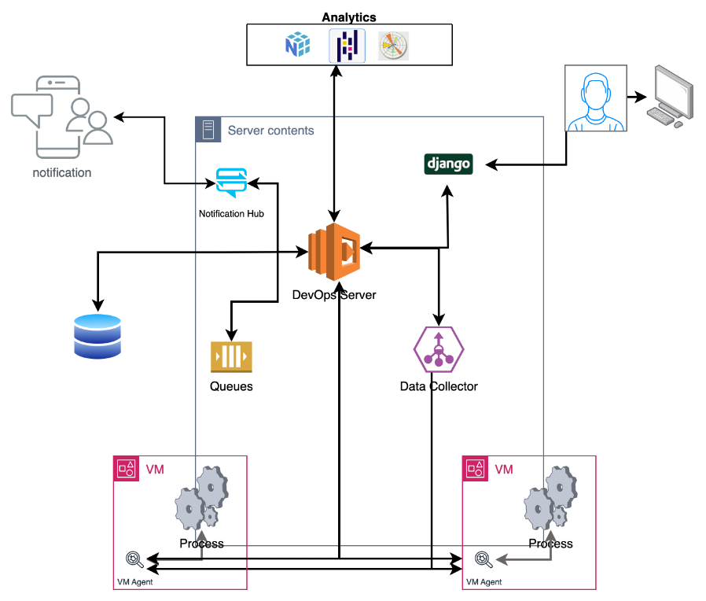

# devopstools
DevOps Toolset

To run the application you need to follow the following steps

from the folder devops

1. Create python3 virtual environment -- python3 -m venv env
2. Activate the environment with -- source env/bin/activate
3. Upgrate pip with -- python -m pip install --upgrade pip
4. pip install -r requirements.txt

Once you finish the environment to setup the application

1. Move into the Project folder -- cd prj_wagntails
2. You need to run the migrations for the Model
3. python manage.py makemigrations devopstools
4. python manage.py migrate devopstools
5. python manage.py migrate

